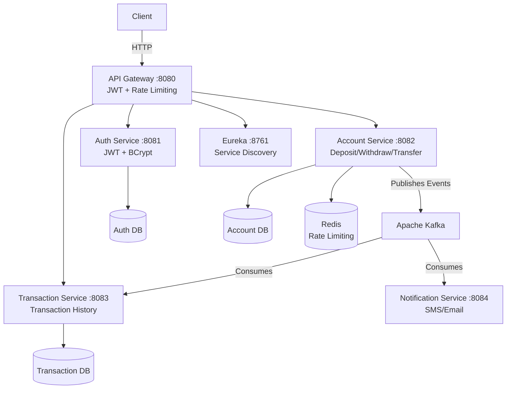
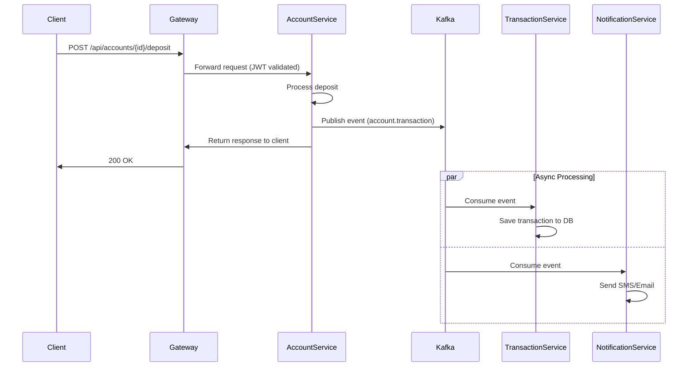

# 🏦 Banking Microservices System

A production-grade distributed banking system built with Java Spring Boot microservices architecture.


---

## 📐 Architecture



## 🛠️ Tech Stack

| Category | Technology |
|---|---|
| Language | Java 17 |
| Framework | Spring Boot 3.5 |
| API Gateway | Spring Cloud Gateway |
| Service Discovery | Netflix Eureka |
| Message Broker | Apache Kafka |
| Databases | PostgreSQL (per service) |
| Caching / Rate Limiting | Redis |
| Security | JWT + Spring Security |
| DB Migrations | Flyway |
| Documentation | SpringDoc OpenAPI (Swagger) |
| Metrics | Prometheus + Grafana |
| Distributed Tracing | Zipkin |
| Containerization | Docker + Docker Compose |
| Testing | JUnit 5 + Mockito (88+ tests) |

---

## 🚀 Services

| Service | Port | Description |
|---|---|---|
| API Gateway | 8080 | Single entry point, JWT validation, rate limiting |
| Auth Service | 8081 | User registration, login, JWT generation |
| Account Service | 8082 | Account management, deposit, withdraw, transfer |
| Transaction Service | 8083 | Transaction recording and history |
| Notification Service | 8084 | SMS/email notifications via Kafka |
| Discovery Server | 8761 | Eureka service registry |

---

## ⚙️ How to Run

### Prerequisites
- Docker Desktop installed and running
- Git

### Start the entire system with one command:

```bash
git clone https://github.com/swatirch/bankapp_microservices.git
cd bankapp_microservices
docker-compose up -d
```

Wait 2-3 minutes for all services to start, then access:

| URL | Description |
|---|---|
| http://localhost:8080/swagger-ui/index.html | Swagger UI (all services) |
| http://localhost:8761 | Eureka Dashboard |
| http://localhost:3000 | Grafana (admin/admin) |
| http://localhost:9091 | Prometheus |
| http://localhost:9411 | Zipkin Distributed Tracing |
| http://localhost:9090 | Kafka UI |

---

## 📡 API Endpoints

All requests go through API Gateway: `http://localhost:8080`

### 🔐 Auth
| Method | Endpoint | Description |
|--------|----------|-------------|
| POST | `/api/auth/register` | Register new user |
| POST | `/api/auth/login` | Login and get JWT token |

### 💰 Accounts
| Method | Endpoint | Description |
|--------|----------|-------------|
| POST | `/api/accounts` | Create account |
| GET | `/api/accounts/{id}` | Get account details |
| POST | `/api/accounts/{id}/deposit` | Deposit money |
| POST | `/api/accounts/{id}/withdraw` | Withdraw money |
| POST | `/api/accounts/{id}/transfer` | Transfer to another account |

### 📋 Transactions
| Method | Endpoint | Description |
|--------|----------|-------------|
| GET | `/api/transactions/account/{id}` | Get transaction history |

### 👑 Admin
| Method | Endpoint | Description |
|--------|----------|-------------|
| GET | `/api/admin/accounts` | List all accounts |
| PATCH | `/api/admin/accounts/{id}/block` | Block account |
| PATCH | `/api/admin/accounts/{id}/unblock` | Unblock account |

## 🔄 Event-Driven Flow



## 📊 Observability

### Grafana Dashboard
- Import dashboard ID: `19004`
- Shows JVM memory, CPU, HTTP request rate, response times per service

### Distributed Tracing (Zipkin)
- Every request traced across all services
- See exact time spent in each service
- Identify bottlenecks instantly

### Metrics Available
/actuator/health     - Service health status
/actuator/prometheus - Prometheus metrics scraping endpoint
/actuator/metrics    - All available metrics

---

## 🔐 Security

- JWT authentication on all endpoints
- Role-based access control (USER / ADMIN)
- Redis-based rate limiting at gateway level
- BCrypt password encoding
- Stateless session management

---

## 🧪 Testing

```bash
# Run tests for a specific service
cd banking-account-service
mvn test

# Test coverage: 88+ tests across all services
# Unit tests: Service layer with Mockito
# Integration tests: Repository layer with H2
```

---

## 📁 Project Structure

```
bankapp_microservices/
│
├── 📦 banking-common/                    # Shared library
│   └── src/main/java/com/banking/common/
│       ├── security/JwtService.java
│       ├── security/JwtFilter.java
│       └── exceptions/
│
├── 🔐 banking-auth-service/              # Authentication (Port: 8081)
│   └── src/main/java/com/banking/auth/
│       ├── controller/
│       ├── service/
│       ├── repository/
│       └── config/SecurityConfig.java
│
├── 💰 banking-account-service/           # Accounts (Port: 8082)
│   └── src/main/java/com/banking/account/
│       ├── controller/
│       ├── service/
│       ├── repository/
│       └── kafka/
│
├── 📋 banking-transaction-service/       # Transactions (Port: 8083)
│   └── src/main/java/com/banking/transaction/
│       ├── controller/
│       ├── service/
│       ├── repository/
│       └── kafka/
│
├── 🔔 banking-notification-service/      # Notifications (Port: 8084)
│   └── src/main/java/com/banking/notification/
│       ├── consumer/
│       └── service/
│
├── 🌐 banking-api-gateway/               # Gateway (Port: 8080)
│   └── src/main/java/com/banking/gateway/
│       ├── config/SecurityConfig.java
│       ├── config/SwaggerConfig.java
│       └── filter/JwtAuthFilter.java
│
├── 🔍 banking-discovery-server/          # Eureka (Port: 8761)
│
├── 🐳 docker-compose.yml                 # Full system orchestration
├── 📊 prometheus.yml                     # Prometheus scrape config
└── 🗄️ init-db.sql                        # Database initialization
```
## 🏭 Production Considerations

- Each service has its own PostgreSQL database (database per service pattern)
- Flyway manages database migrations
- HikariCP connection pooling configured per service
- Kafka ensures reliable async communication between services
- Prometheus sampling set to 10% (production-ready)
- Multi-stage Docker builds for minimal image size
